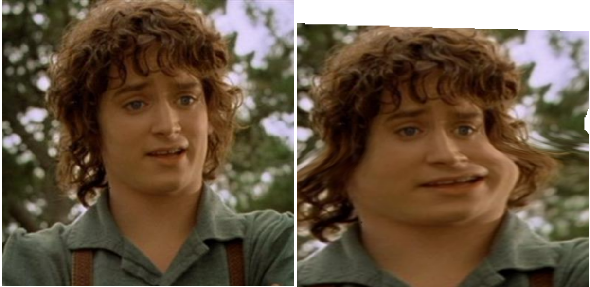

reexpress
=========

Reexpress morphs hand-drawn expressions in your browser using javascript, HTML5
canvas, and SVG, based on the techniques described in the paper [_Performance-Driven Hand-Drawn
Animation_][0] by Buck et al.

Authors: Steven Ruppert and Daria Tolmacheva

For Final Project, CSCI 561 Advanced Graphics, Spring 2014, at the Colorado
School of Mines.

## Demos

Reexpress is implemented as a series of separate demos.

### Beier-Neely morphing

http://blendmaster.github.io/reexpress/onewarp.html

Implements basic [Beier-Neely morphing][1]. Load an image, then move around the
control points to see how the resulting image on the right changes. The `a`, `b`,
and `p` parameters for weighting multiple control lines can be changed with the
sliders.

To add a new control line, click and drag on one of the images. To add a point to
an existing line, click somewhere on the point. To remove a point, drag it off the
canvas (to remove a line, drag all its points off the canvas).

### Morphing smoothly between images

http://blendmaster.github.io/reexpress/warp.html

Implements the same morphing algorithm, but with linear interpolation between
three possible images and their control points.

The same image loading and control line editing features apply. What's new is
the triangle, which controls warping between the three images. Clicking or
dragging the black cursor will change the weights of the images in the
control lines as well as the alpha blending in the final output.

The blue control lines show the weighted average of the lines, and they
can also be drawn in green on the intermediate warped images. This makes
the effect of the `b` parameter for multiline warps more apparent (at
high values of `p`, the green lines correspond better at the cost of artifacts
in the rest of the blended image.

### Morphing smoothly between multiple expressions

http://blendmaster.github.io/reexpress/index.html

We drew some cartoon characters with different facial expression and trained control
points on them. When this demo is loaded, the "simba" model is preloaded for you.

The left pane shows all our pre-drawn images in a 2d space by the average of all the
points in the control lines (i.e., a dimensionality reduction to 2d). The delaunay
triangulation between these points is also shown. The black cursor shows where the
output image on the right is generated from. Inside of a triangle, the three vertices
are blended together in the same manner as the 3-image demo.

To load the "mike" character, select the character from the dropdown menu, and refresh
the page.

Unfortunately, the expression can only be controlled by the mouse cursor. As computer
vision algorithms and webcam support for HTML5 increases, we hope to implement
an active appearence model or active shape model to drive the warping from live
webcam images, like the original papers.

Our images are warped in their entirety, which means that the extremities of the
image don't have good correspondence (doesn't look convincing). The original
paper only warps the eye and mouth regions, with better looking results.

## Implementation details

The warping algorithm iteself is implemented in plain javascript, using the
canvas API to pull out pixels from the input images. Unfortunately it is not
very fast, so the various demos use different levels of subsampling instead of
warping every single pixel on the canvas. We use the numeric.js library for
some of the vector operations required.

The warping algorithm could also be implemented on the GPU using webGL, by
warping only a small set of triangle coordinates, and using the texture
interpolation to warp the pixels in place. For a real-time version of this project,
such a solution is probably necessary.

Another thing to do would be to move the warping off the main thread and in to
 a Web Worker, which could also allow for incremental refinement, e.g.,
first show a crude subsampled warp, then progressively show better versions
when they are calculated.

The editing of the control points is done using SVG and d3. The points are bound
to javascript arrays internally, which drive the warping algorithm. After the
lines are moved (or other parameters to the algorithm are changed), the
warp is updated after a short debouncing delay.

The delaunay triangulation is done by d3's built in voronoi libray.

For our "simba" and "mike" data sets, we hand-picked the control points and
stored them as JSON, in the `simba.js` and `mike.js` files.

We used the same set of control points as detailed in the paper. The format
of the JSON arrays is documented in `reexpress.js`.

[0]: http://gfx.cs.princeton.edu/gfx/pubs/Buck_2000_PHA/index.php
[1]: http://www.hammerhead.com/thad/morph.html
